# Development Guide

Development workflow for Bazel Caching Example.

## Prerequisites

- Bazel 9.2.0+ (install via Homebrew: `brew install bazel`)
- Docker Desktop (for cache server)
- macOS (Apple Silicon native) or Linux with x86_64 architecture

## Local Setup

```bash
# 1. Setup development environment
./scripts/setup.sh

# 2. Verify cache server is running
docker ps | grep bazel-remote

# 3. Build and test
bazel build //...
bazel test //...
```

## Code Structure

```
├── app/              # Application code (hello world example)
├── lib/              # Shared libraries (math functions)
├── benchmark/        # Heavy computation benchmarks
├── infrastructure/   # Docker & deployment config
├── scripts/          # Automation scripts
└── docs/             # Technical documentation
```

## Building & Testing

### Quick Build
```bash
bazel build //app:hello
```

### Run Cache Demonstration
```bash
# Quick demo (5-10 seconds)
./scripts/demonstrate-cache.sh

# With metrics dashboard
./scripts/demonstrate-cache.sh metrics

# Heavy benchmark (60-120 seconds)
./scripts/demonstrate-cache.sh benchmark

# All options combined
./scripts/demonstrate-cache.sh metrics benchmark clear-remote
```

### Run Tests
```bash
# All tests
bazel test //...

# Specific test
bazel test //app:hello_test
bazel test //lib:math_test
```

## Logging Standards

All scripts follow consistent logging patterns:

### Log Levels
- `[STEP]` - Major operation phases (cyan)
- `→` - Detailed action steps (blue)
- `✓` - Success indicators (green)
- `⚠️` - Warnings (yellow)
- `❌` - Errors (red)

### Script Logging Example
```bash
log_step "Building target"           # Phase
log_detail "Compiling sources..."    # Action
log_success "Build complete"         # Result
```

### Cache Query Logging
```bash
log_cache_query "GetActionResult($KEY...)"  # Underway
log_detail "Result: FOUND ✓"                 # Success
```

---

## Complete Execution Flow & Code Mapping

This diagram shows the complete journey of `bazel build //app:hello` with remote caching, including code references and status indicators.

```mermaid
graph TD
    User["👤 User Terminal"]
    
    subgraph CMD["🖥️ STEP 1: User Invokes Build"]
        UserCmd["bazel build //app:hello<br/>--config=remote-cache"]
    end
    
    subgraph BAZELRC["📋 STEP 2: Load Configuration (.bazelrc)"]
        BazelrcFile["Config File: .bazelrc#L32-L38<br/>remote_cache=http://localhost:8085<br/>remote_timeout=3600s<br/>remote_upload_local_results=true"]
        BazelrcCode["✅ ACTIVE: Config applied"]
    end
    
    subgraph BUILD["📦 STEP 3: Parse BUILD Target"]
        BuildFile["Build File: app/BUILD#L5-L16<br/>cc_binary(name='hello')<br/>srcs=['main.cc']<br/>deps=['lib:math']"]
        BuildDeps["Dependencies:<br/>• app/main.cc<br/>• app/hello.cc<br/>• app/hello.h<br/>• lib/math.h<br/>• lib/math.cc"]
    end
    
    subgraph ACTIONKEY["🔐 STEP 4: Compute Action Key"]
        ActionSrc["Sources Hash (SHA256):<br/>main.cc, hello.cc, hello.h<br/>math.cc, math.h"]
        ActionBuild["BUILD Rule:<br/>@rules_cc//cc:defs.bzl<br/>cc_binary(name='hello')"]
        ActionFlags["Compiler Flags (.bazelrc#L19-L21):<br/>-std=c++17<br/>-Wall -Wextra -Werror<br/>-fPIC"]
        ActionToolchain["Toolchain Info:<br/>C++ 17<br/>Platform: x86_64/arm64"]
        ActionKey["Generate:<br/>SHA256(sources + rule + flags + toolchain)<br/>= a1b2c3d4e5f6g7h8..."]
    end
    
    subgraph CACHE["☁️ STEP 5: Query Remote Cache"]
        CacheServer["Remote Server: localhost:8085<br/>Container: bazel-remote-server ✅<br/>Port: 8085 (docker-compose.yml#L12)"]
        CacheReq["gRPC Request:<br/>GetActionResult(action_key:<br/>a1b2c3d4e5f6g7h8...)"]
        CacheLookup["Action Cache Lookup:<br/>Path: /var/bazel-remote/cache<br/>(Dockerfile#L24-L26)"]
    end
    
    subgraph DECISION["⚖️ STEP 6: Hit or Miss?"]
        HitCheck{{"Key Found?<br/>a1b2c3d4... exists?"}}
    end
    
    subgraph CACHEHIT["✅ CACHE HIT PATH"]
        HitResponse["Response: ActionResult<br/>OutputDigests: [cas://digest1]<br/>ExecTime: 45ms"]
        CASDownload["CAS Download (1-4MB chunks):<br/>From: /var/bazel-remote/cache<br/>To: ~/.cache/bazel/"]
        HitLink["Link & Use:<br/>Binary ready in 50-200ms<br/>✨ No recompilation!"]
    end
    
    subgraph CACHEMISS["❌ CACHE MISS PATH"]
        MissResponse["Response: NOT_FOUND<br/>No cached result for this key"]
        LocalCompile["LOCAL COMPILATION (400-800ms):<br/>$ g++ -std=c++17 -c main.cc → main.o<br/>$ g++ -std=c++17 -c hello.cc → hello.o<br/>$ g++ main.o hello.o -o hello"]
        LocalLink["Link Artifacts:<br/>Create: app/bazel-bin/app/hello<br/>Time: 100ms"]
    end
    
    subgraph UPLOAD["📤 STEP 7: Upload to Cache (Miss Only)"]
        PrepArtifacts["Prepare Artifacts:<br/>hello (binary)<br/>hello.o (object files)"]
        CalcDigest["Calculate CAS Digests:<br/>SHA256(hello) = digest1<br/>SHA256(hello.o) = digest2"]
        UploadCAS["Upload to CAS:<br/>POST /v2/uploads/file<br/>to: /var/buildbuddy/cache<br/>Size: 2.4MB"]
        StoreAction["Store in Action Cache:<br/>a1b2c3d4... → [digest1, digest2]<br/>Time: 200-500ms"]
    end
    
    subgraph RESULT["🎯 STEP 8: Return Result"]
        Success["✓ Build Complete<br/>Binary: app/bazel-bin/app/hello<br/>Ready to use"]
    end
    
    subgraph CONFIG_DISABLED["⚠️ DISABLED/OPTIONAL CODE"]
        RemoteExec["🔴 NOT ACTIVE: Remote Execution<br/>config:remote executor=http://localhost:8085<br/>(.bazelrc#L45-L49)<br/>BuildBuddy Executor disabled<br/>(docker-compose.yml#L28-L62)"]
    end
    
    User -->|Runs Command| UserCmd
    UserCmd -->|Loads Config| BazelrcFile
    BazelrcFile --> BazelrcCode
    
    BazelrcCode -->|Parses Target| BuildFile
    BuildFile -->|Resolves Deps| BuildDeps
    BuildDeps -->|Hash Sources| ActionSrc
    ActionSrc -->|Parse Rule| ActionBuild
    ActionBuild -->|Extract Flags| ActionFlags
    ActionFlags -->|Get Toolchain| ActionToolchain
    ActionToolchain -->|SHA256 Hash| ActionKey
    
    ActionKey -->|Send via gRPC| CacheServer
    CacheServer -->|Query| CacheReq
    CacheReq -->|Lookup Key| CacheLookup
    CacheLookup --> HitCheck
    
    HitCheck -->|✅ YES - Cache Hit| HitResponse
    HitCheck -->|❌ NO - Cache Miss| MissResponse
    
    HitResponse -->|Download CAS| CASDownload
    CASDownload -->|Link Binary| HitLink
    HitLink --> Success
    
    MissResponse -->|Compile Sources| LocalCompile
    LocalCompile -->|Link Objects| LocalLink
    LocalLink -->|Prep Artifacts| PrepArtifacts
    PrepArtifacts -->|Hash Results| CalcDigest
    CalcDigest -->|Upload CAS| UploadCAS
    UploadCAS -->|Index Action| StoreAction
    StoreAction --> Success
    
    Success -->|Done| User
    
    RemoteExec -.->|Not Used| HitCheck
    
    style User fill:#e6f5ff,stroke:#0066cc,stroke-width:2px,color:#000
    style UserCmd fill:#d4e8f7,stroke:#333,stroke-width:2px,color:#000
    
    style BazelrcFile fill:#e6f2ff,stroke:#0066cc,stroke-width:2px,color:#000
    style BazelrcCode fill:#c3e6cb,stroke:#28a745,stroke-width:2px,color:#000
    
    style BuildFile fill:#fff8dc,stroke:#ff8c00,stroke-width:2px,color:#000
    style BuildDeps fill:#ffe4b5,stroke:#ff8c00,stroke-width:2px,color:#000
    
    style ActionSrc fill:#ffd9b3,stroke:#ff9900,stroke-width:2px,color:#000
    style ActionBuild fill:#ffd9b3,stroke:#ff9900,stroke-width:2px,color:#000
    style ActionFlags fill:#ffd9b3,stroke:#ff9900,stroke-width:2px,color:#000
    style ActionToolchain fill:#ffd9b3,stroke:#ff9900,stroke-width:2px,color:#000
    style ActionKey fill:#f5f5f5,stroke:#333,stroke-width:3px,color:#333
    
    style CacheServer fill:#fffacd,stroke:#ff9900,stroke-width:2px,color:#000
    style CacheReq fill:#fffacd,stroke:#ff9900,stroke-width:2px,color:#000
    style CacheLookup fill:#fffacd,stroke:#ff9900,stroke-width:2px,color:#000
    
    style HitCheck fill:#fff4e6,stroke:#ff9900,stroke-width:3px,color:#000
    
    style HitResponse fill:#d4edda,stroke:#28a745,stroke-width:2px,color:#000
    style CASDownload fill:#d4edda,stroke:#28a745,stroke-width:2px,color:#000
    style HitLink fill:#c3e6cb,stroke:#28a745,stroke-width:3px,color:#000
    
    style MissResponse fill:#f8d7da,stroke:#dc3545,stroke-width:2px,color:#000
    style LocalCompile fill:#f5c6cb,stroke:#dc3545,stroke-width:2px,color:#000
    style LocalLink fill:#f5c6cb,stroke:#dc3545,stroke-width:2px,color:#000
    
    style PrepArtifacts fill:#e6ccff,stroke:#9933ff,stroke-width:2px,color:#000
    style CalcDigest fill:#e6ccff,stroke:#9933ff,stroke-width:2px,color:#000
    style UploadCAS fill:#e6ccff,stroke:#9933ff,stroke-width:2px,color:#000
    style StoreAction fill:#e6ccff,stroke:#9933ff,stroke-width:2px,color:#000
    
    style Success fill:#c3e6cb,stroke:#28a745,stroke-width:3px,color:#000
    
    style RemoteExec fill:#e0e0e0,stroke:#999999,stroke-width:2px,color:#666
    
    style CMD fill:#e6f5ff,stroke:#0066cc,stroke-width:2px
    style BAZELRC fill:#e6f5ff,stroke:#0066cc,stroke-width:2px
    style BUILD fill:#fff5e6,stroke:#ff9900,stroke-width:2px
    style ACTIONKEY fill:#fff5e6,stroke:#ff9900,stroke-width:2px
    style CACHE fill:#fff9e6,stroke:#ffb800,stroke-width:2px
    style DECISION fill:#fff0e6,stroke:#ff9900,stroke-width:2px
    style CACHEHIT fill:#e6ffe6,stroke:#28a745,stroke-width:2px
    style CACHEMISS fill:#ffe6e6,stroke:#dc3545,stroke-width:2px
    style UPLOAD fill:#f0e6ff,stroke:#9933ff,stroke-width:2px
    style RESULT fill:#e6ffe6,stroke:#28a745,stroke-width:3px
    style CONFIG_DISABLED fill:#f5f5f5,stroke:#999999,stroke-width:2px
```



### Legend

| Color | Meaning | Example |
|-------|---------|---------|
| 🟢 Green | Functional & Active | Configuration applied, Cache HIT, Build result |
| 🔵 Blue | Configuration/Input | .bazelrc, User command |
| 🟠 Orange | Build Process | Source parsing, compilation flags |
| 🟡 Yellow | Network/Remote | Cache server queries, gRPC calls |
| 🟣 Purple | CAS Upload | Artifact storage and indexing |
| ⚫ Gray | Disabled/Optional | Remote execution not active |

### Important Clarification: Service & Path Naming

All components now use consistent **bazel-remote** naming:

| Component | Name | Location |
|-----------|------|----------|
| ✅ **Service** | `bazel-remote` | docker-compose.yml#L6 |
| ✅ **Container** | `bazel-remote-server` | docker-compose.yml#L8 |
| ✅ **Volume** | `bazel-remote-cache` | docker-compose.yml#L66 |
| ✅ **Cache Path** | `/var/bazel-remote/cache` | Dockerfile#L24 |
| ✅ **Network** | `bazel-remote-network` | docker-compose.yml#L68 |
| ✅ **Port** | `8085` | gRPC API for cache queries |

**Running**: `bazel-remote` (lightweight cache-only server)  
**NOT Running**: BuildBuddy remote execution (disabled by default)

All artifacts are managed by **bazel-remote**, not BuildBuddy.

### Code Navigation

Click on the file references to explore:
- [.bazelrc](../.bazelrc) - Remote cache configuration
- [app/BUILD](../app/BUILD) - Target definition & dependencies
- [Dockerfile](../infrastructure/docker/Dockerfile) - bazel-remote setup
- [docker-compose.yml](../infrastructure/docker/docker-compose.yml) - Container orchestration

---

## Performance Profiling

### View Build Metrics
```bash
./scripts/metrics.sh
```

Shows:
- Cache server status and storage capacity
- Bazel version and configuration
- Docker container status
- Project structure statistics

### Analyze Cache Performance
```bash
# First build (creates cache)
./scripts/demonstrate-cache.sh clear-remote

# Second build (uses cache)
./scripts/demonstrate-cache.sh

# Output shows:
# - Time comparison
# - Remote cache hit count
# - Cache statistics
```

## Making Changes

### Target Naming Convention
- Libraries: `{name}_lib` (e.g., `compute_lib`)
- Binaries: `{name}` or `{name}_demo` (e.g., `cache_demo`)
- Tests: `{name}_test` (e.g., `math_test`)

### BUILD File Template
```python
load("@rules_cc//cc:defs.bzl", "cc_library", "cc_binary", "cc_test")

cc_library(
    name = "my_lib",
    srcs = ["my_lib.cc"],
    hdrs = ["my_lib.h"],
    deps = [],
    copts = ["-Wall", "-Wextra"],
)

cc_test(
    name = "my_lib_test",
    srcs = ["my_lib_test.cc"],
    deps = [":my_lib", "@com_google_googletest//:gtest_main"],
)
```

### Commit Message Format

```
<type>: <subject>

<body>

<footer>
```

**Types:**
- `feat:` New feature or enhancement
- `fix:` Bug fix
- `perf:` Performance improvement
- `refactor:` Code restructuring
- `test:` Test additions/fixes
- `docs:` Documentation updates
- `ci:` CI/CD configuration
- `chore:` Maintenance tasks

**Example:**
```
feat: add streaming cache upload support

Implement gRPC streaming for faster artifact uploads
to remote cache, reducing upload time by ~30%.

- Add streaming encoder in cache client
- Update BUILD file with new proto deps
- Test with 1GB+ artifacts

Closes #42
```

## Git Workflow

### Before Committing
```bash
# Format code
bazel build //...

# Run all tests
bazel test //...

# Check cache with fresh build
./scripts/demonstrate-cache.sh clear-remote benchmark
```

### Line Endings
This project uses `.gitattributes` to ensure consistent LF line endings:
- Scripts, code, and documentation: LF
- Binary artifacts: unchanged

Git will automatically convert line endings on commit.

## Debugging

### View Build Log
```bash
bazel build //app:hello -v 2>&1 | grep -i "action\|compile"
```

### Inspect Action Cache
```bash
curl http://localhost:8085/status | jq .
```

### Cache Server Logs
```bash
docker logs bazel-remote-server
```

### Clear All Caches
```bash
bazel clean                           # Local cache
./scripts/demonstrate-cache.sh clear-remote  # Remote cache
```

## Performance Targets

### Build Times
- **Quick demo** (`//app:hello`): 40-60ms
  - Cache miss: 40-60ms
  - Cache hit: 30-50ms
  - Expected speedup: ~10-20% (overhead-limited)

- **Heavy benchmark** (`//benchmark:cache_demo`): 500-1200ms
  - Cache miss: 850-1500ms
  - Cache hit: 400-600ms
  - Expected speedup: 50-66%

### Cache Efficiency
- Compression ratio: 70%+ (typical)
- Storage overhead: <1% of max cache size
- HTTP/gRPC latency: <20ms

## Troubleshooting

### Cache not hitting
```bash
# Check server health
curl http://localhost:8085/status

# Verify remote cache flag
bazel build //benchmark:cache_demo --remote_cache=http://localhost:8085

# Clear and retry
./scripts/demonstrate-cache.sh clear-remote benchmark
```

### Build failures
```bash
# Clean build from scratch
bazel clean --expunge
bazel build //...

# Check environment
./scripts/metrics.sh
```

### Docker issues
```bash
# Restart cache server
docker-compose -f infrastructure/docker/docker-compose.yml restart

# View logs
docker-compose -f infrastructure/docker/docker-compose.yml logs
```

## Contributing

1. Create feature branch: `git checkout -b feat/your-feature`
2. Make changes with proper logging
3. Run: `bazel test //...`
4. Verify cache with: `./scripts/demonstrate-cache.sh benchmark`
5. Commit with conventional messages
6. Push and create pull request

## Code Style

- **C++**: Use `-Wall -Wextra` compiler flags
- **Shell**: Use `#!/bin/bash` shebang, proper quoting
- **Bazel**: Follow official best practices, clear target names
- **Comments**: Document *why*, not *what*

## Performance Tips

- Use `--disk_cache` for persistent local builds
- Enable `--remote_upload_local_results` for cache warming
- Use `--jobs=N` to match CPU cores
- Profile with: `bazel build --profile=/tmp/profile.gz`

---

**Questions?** See [README.md](README.md) for architecture overview or [docs/](docs/) for technical details.
