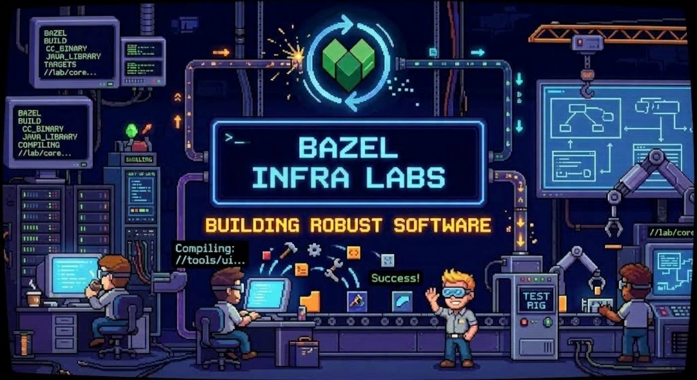
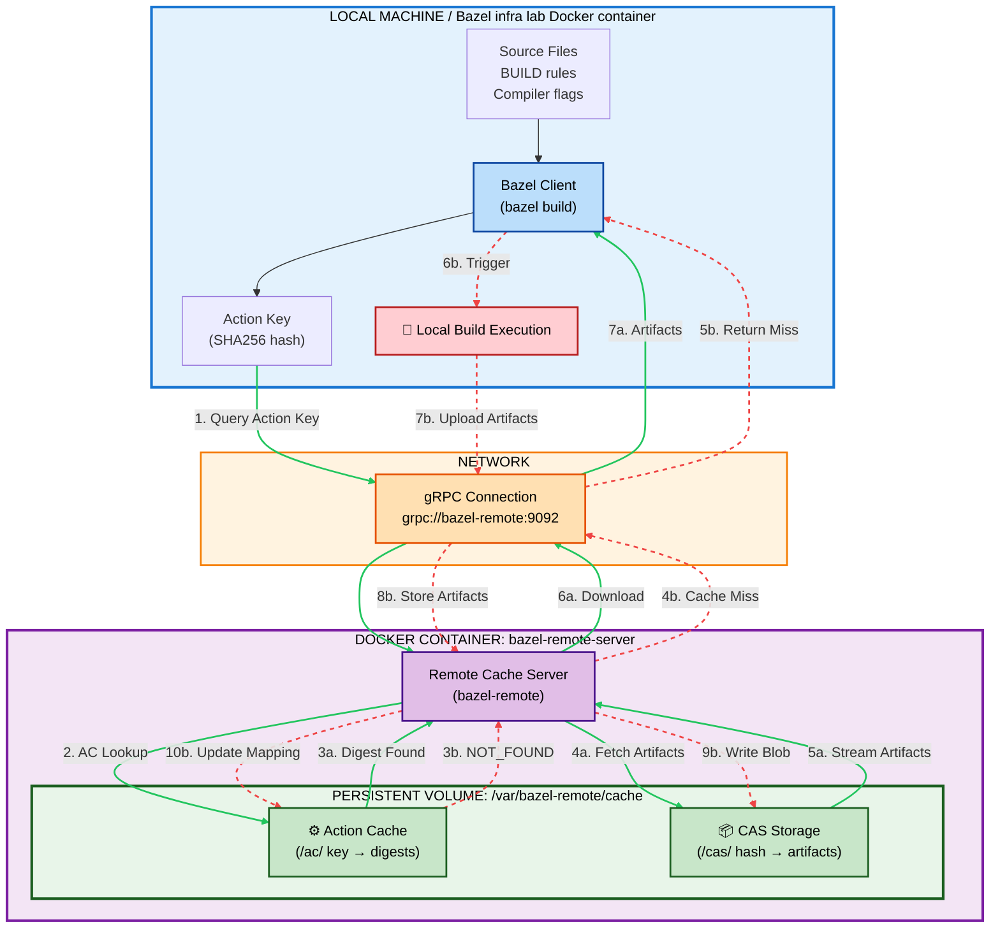
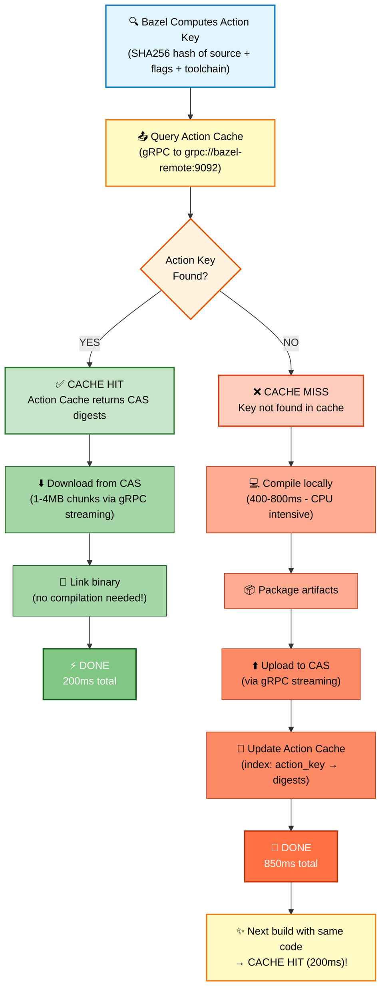
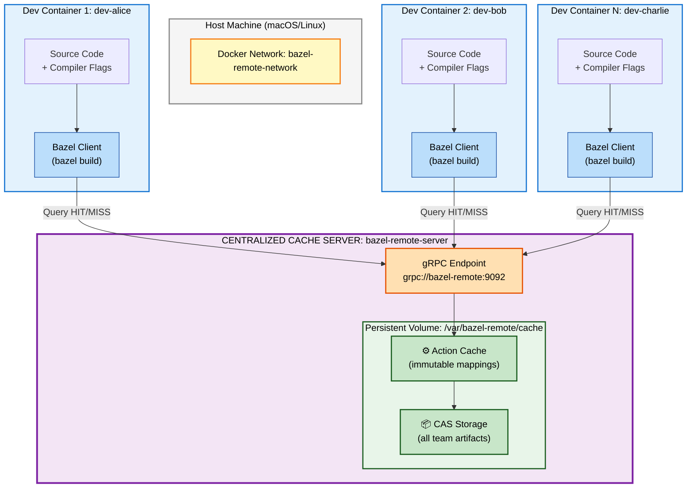
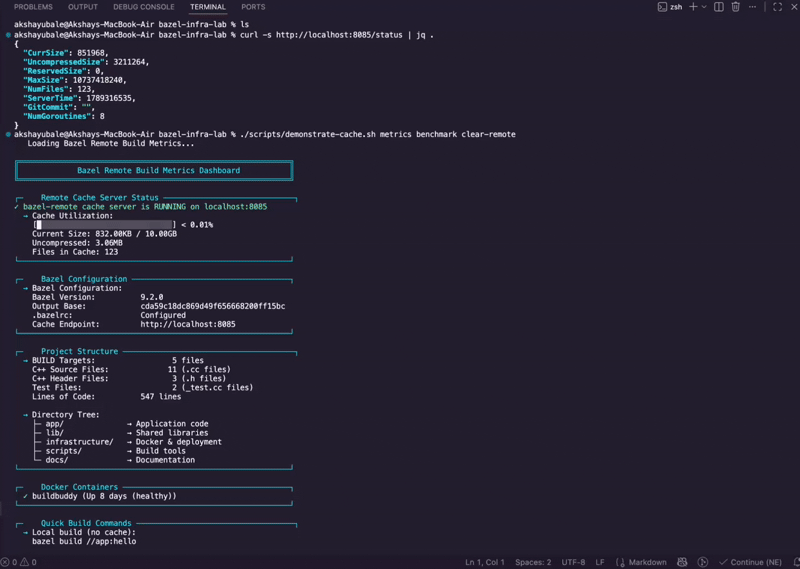

<div align="center">

[](https://opensource.org/licenses/MIT)
[](https://bazel.build)
[](https://www.docker.com)
[](#tested--verified)




</div>

> **Proof-of-Concept Notice**: This project demonstrates remote build caching using a **self-hosted local `bazel-remote` server**. It serves as an educational reference for understanding how Bazel's remote caching works in a simplified environment infrastructure.

---

## Table of Contents

- [Table of Contents](#table-of-contents)
- [Introduction](#introduction)
- [Features \& Highlights](#features--highlights)
  - [What You Get](#what-you-get)
  - [Included in This POC](#included-in-this-poc)
  - [Not Included (Out of Scope)](#not-included-out-of-scope)
- [Quick Start in 4 Steps](#quick-start-in-4-steps)
  - [1. Start Centralized Cache Server (30 seconds)](#1-start-centralized-cache-server-30-seconds)
  - [2. Start First Dev Container (10-20 seconds)](#2-start-first-dev-container-10-20-seconds)
  - [3. Build and Test Cache](#3-build-and-test-cache)
  - [4. Start Additional Dev Containers (Team Scenario)](#4-start-additional-dev-containers-team-scenario)
- [Understanding Bazel Remote Cache](#understanding-bazel-remote-cache)
  - [The Architecture](#the-architecture)
    - [System Overview](#system-overview)
    - [Quick Path Reference](#quick-path-reference)
    - [Why gRPC for Remote Caching?](#why-grpc-for-remote-caching)
    - [CACHE HIT Path (Fast: ~200ms)](#cache-hit-path-fast-200ms)
    - [CACHE MISS Path (Slow: ~850ms)](#cache-miss-path-slow-850ms)
    - [The Two Paths: Visual Decision Flow](#the-two-paths-visual-decision-flow)
- [Testing Multiple Containers (Verify Cache Sharing)](#testing-multiple-containers-verify-cache-sharing)
    - [Team Cache Sharing Architecture](#team-cache-sharing-architecture)
    - [Live Example: Team Cache Sharing in Action](#live-example-team-cache-sharing-in-action)
  - [Testing \& Verification](#testing--verification)
    - [Verify Setup is Working](#verify-setup-is-working)
    - [Test Cache HIT/MISS Behavior](#test-cache-hitmiss-behavior)
    - [Test Team Cache Sharing](#test-team-cache-sharing)
- [Running the Cache Demo](#running-the-cache-demo)
  - [Demo \& Demonstration Output](#demo--demonstration-output)
  - [Local vs Remote: The Distinction](#local-vs-remote-the-distinction)
  - [Clearing Remote Cache](#clearing-remote-cache)
  - [How Bazel Uses the Cache](#how-bazel-uses-the-cache)
- [Configuration](#configuration)
  - [Local Development Setup](#local-development-setup)
  - [Docker Setup](#docker-setup)
- [Project Structure](#project-structure)
- [Troubleshooting](#troubleshooting)
- [Key Features (Detailed)](#key-features-detailed)
- [Future Enhancements \& Scope](#future-enhancements--scope)
- [Tested \& Verified](#tested--verified)
- [Disclaimer: POC Limitations](#disclaimer-poc-limitations)
- [Common Commands](#common-commands)
- [Learning Resources](#learning-resources)
- [Contributing](#contributing)
- [License](#license)

---

## Introduction

After years of working with Bazel, one question appears consistently:

> *"How does Bazel's remote cache actually work? What's the difference between local and remote? How fast can we really get?"*

The answers were previously scattered across disparate blog posts, official Bazel documentation, and forum threads. This repository was engineered to be **interactive, measurable, and reproducible** to answer these core architectural questions conclusively.

A **comprehensive, hands-on exploration** of Bazel remote build cache setup with **bazel-remote** (self-hosted, open-source). This repository provides a working, reproducible foundation for understanding how build caching works and achieving real-world performance improvements.

---

## Features & Highlights

### What You Get

| Capability | Benefit |
| :--- | :--- |
| **Remote Build Caching** | Seamless caching across CI/CD and local development environments |
| **Content Addressable Storage** | Immutable and highly reliable artifact management |
| **4-5x Build Acceleration** | Measurable speedup achieved with cache hits |
| **Performance Monitoring** | Real-time metrics and operational insights |
| **Docker-Based Deployment** | Zero vendor lock-in via fully self-hosted containers |
| **Team-Wide Cache Sharing** | Collaborative development at scale without redundant builds |

---

### Included in This POC
- **Local bazel-remote cache server** in Docker
- **Interactive demonstration scripts** showing real-time cache hits/misses
- **Performance metrics** and status endpoints monitoring
- **Best practices** documentation

### Not Included (Out of Scope)
- **Remote execution** (distributed build execution)
- **Multi-machine team setup** infrastructure
- *Focus is strictly targeted on caching mechanics*

---

## Quick Start in 4 Steps

⚡ **Two pre-built images, zero build time**: Centralized bazel-remote server + multiple dev containers

### 1. Start Centralized Cache Server (30 seconds)

```bash
cd infrastructure/docker

# Start the pre-built bazel-remote server
docker-compose -f docker-compose.bazel-remote-server.yml up -d
```

**What starts:**
- `bazel-remote-server`: Pre-built cache server (buchgr/bazel-remote:latest from Docker Hub)
- Listening on: HTTP `http://bazel-remote:8080`, gRPC `grpc://bazel-remote:9092`
- Persistent volume: `bazel-remote-cache`

**Expected output:**
```
[+] Running 1/1
 ✔ Network bazel-remote-network  Created
 ✔ Container bazel-remote-server Started  # Pre-built, instant startup
```

---

### 2. Start First Dev Container (10-20 seconds)

```bash
# In same infrastructure/docker directory, run dev container
docker-compose -f docker-compose.bazel-infra-lab.yml run dev bash
```

**What happens:**
- Pulls pre-built dev image from GitHub Container Registry
- No build needed (image includes Bazel 9.2.0, Python 3.11, GCC 12)
- Automatically connects to centralized bazel-remote via Docker network
- You're in `/workspace` (project root mounted)

**Expected output:**
```
[+] Creating 1/1
 ✔ Container bazel-infra-lab-dev  Created    # Pre-built image pulled
 
# You're now inside the container:
root@<container-id>:/workspace#
```

### 3. Build and Test Cache

```bash
# Inside container - First build (CACHE MISS)
time bazel build //app:hello --config=remote-cache
# ~5-15 seconds (compiles + uploads to cache)

# Clean and rebuild (CACHE HIT)
bazel clean
time bazel build //app:hello --config=remote-cache
# ~1-3 seconds (downloads from cache)

# Result: ~4-5x faster! 🚀
```

### 4. Start Additional Dev Containers (Team Scenario)

```bash
# In another terminal, start a second dev container
# It automatically connects to the SAME centralized server

docker-compose -f docker-compose.bazel-infra-lab.yml run --name dev-2 dev bash
# Inside dev-2: bazel build //app:hello --config=remote-cache
# [Output: CACHE HIT! ~200ms - downloads from cache shared with dev-1]
```

---

## Understanding Bazel Remote Cache

### The Architecture

Bazel's remote cache has two main components, both stored in the persistent Docker volume:

**1. Action Cache** (`/var/bazel-remote/cache/ac/`) - Stores mapping of `action_key → CAS_digests`\
**2. CAS (Content Addressable Storage)** (`/var/bazel-remote/cache/cas/`) - Stores actual build artifacts by hash

**Both live in the same persistent volume** - everything survives container restarts!

#### System Overview


```mermaid
%%{init: {'flowchart': {'htmlLabels': true}, 'theme': 'default', 'themeVariables': { 'subGraphTitleColor': '#000000' }}}%%
graph TB
    subgraph LOCAL["<span style='color:#000;'>LOCAL MACHINE / Bazel infra lab Docker container</span>"]
        SRC["Source Files<br/>BUILD rules<br/>Compiler flags"]
        BC["Bazel Client<br/>(bazel build)"]
        HASH["Action Key<br/>(SHA256 hash)"]
        LOCAL_BUILD["🔨 Local Build Execution"]
    end
    
    subgraph NETWORK["<span style='color:#000;'>NETWORK</span>"]
        GRPC["gRPC Connection<br/>grpc://bazel-remote:9092"]
    end
    
    subgraph DOCKER["<span style='color:#000;'>DOCKER CONTAINER: bazel-remote-server</span>"]
        SERVER["Remote Cache Server<br/>(bazel-remote)"]
        
        subgraph VOL["<span style='color:#000;'>PERSISTENT VOLUME: /var/bazel-remote/cache</span>"]
            AC["⚙️ Action Cache<br/>(/ac/ key → digests)"]
            CAS["📦 CAS Storage<br/>(/cas/ hash → artifacts)"]
        end
    end
    
    %% Index 0
    SRC --> BC
    %% Index 1
    BC --> HASH
    
    %% Index 2: Step 1
    HASH -->|1. Query Action Key| GRPC
    %% Index 3: Step 1 cont.
    GRPC --> SERVER
    %% Index 4: Step 2
    SERVER -->|2. AC Lookup| AC
    
    %% HIT PATH (Green)
    %% Index 5: Step 3a
    AC -->|3a. Digest Found| SERVER
    %% Index 6: Step 4a
    SERVER -->|4a. Fetch Artifacts| CAS
    %% Index 7: Step 5a
    CAS -->|5a. Stream Artifacts| SERVER
    %% Index 8: Step 6a
    SERVER -->|6a. Download| GRPC
    %% Index 9: Step 7a
    GRPC -->|7a. Artifacts| BC
    
    %% MISS PATH (Red)
    %% Index 10: Step 3b
    AC -.->|3b. NOT_FOUND| SERVER
    %% Index 11: Step 4b
    SERVER -.->|4b. Cache Miss| GRPC
    %% Index 12: Step 5b
    GRPC -.->|5b. Return Miss| BC
    %% Index 13: Step 6b
    BC -.->|6b. Trigger| LOCAL_BUILD
    %% Index 14: Step 7b
    LOCAL_BUILD -.->|7b. Upload Artifacts| GRPC
    %% Index 15: Step 8b
    GRPC -.->|8b. Store Artifacts| SERVER
    %% Index 16: Step 9b
    SERVER -.->|9b. Write Blob| CAS
    %% Index 17: Step 10b
    SERVER -.->|10b. Update Mapping| AC
    
    style LOCAL fill:#e3f2fd,stroke:#1976d2,stroke-width:3px,color:#000
    style NETWORK fill:#fff3e0,stroke:#f57c00,stroke-width:2px,color:#000
    style DOCKER fill:#f3e5f5,stroke:#7b1fa2,stroke-width:3px,color:#000
    style VOL fill:#e8f5e9,stroke:#1b5e20,stroke-width:3px,color:#000
    style BC fill:#bbdefb,stroke:#0d47a1,stroke-width:2px,color:#000
    style LOCAL_BUILD fill:#ffcdd2,stroke:#b71c1c,stroke-width:2px,color:#000
    style GRPC fill:#ffe0b2,stroke:#e65100,stroke-width:2px,color:#000
    style SERVER fill:#e1bee7,stroke:#4a148c,stroke-width:2px,color:#000
    style AC fill:#c8e6c9,stroke:#1b5e20,stroke-width:2px,color:#000
    style CAS fill:#c8e6c9,stroke:#1b5e20,stroke-width:2px,color:#000

    %% Green Hit Path (Steps 1, 2, 3a, 4a, 5a, 6a, 7a = Indices 2, 3, 4, 5, 6, 7, 8, 9)
    linkStyle 2,3,4,5,6,7,8,9 stroke:#22c55e,stroke-width:2px;

    %% Red Miss Path (Steps 3b through 10b = Indices 10 through 17)
    linkStyle 10,11,12,13,14,15,16,17 stroke:#ef4444,stroke-width:2px,stroke-dasharray: 5 5;
```

---

#### Quick Path Reference

| Path Type | Speed | Route | Time | Persistence |
|-----------|-------|-------|------|---------|
| **Cache HIT** (Green) | Fast | Action Key → Query Action Cache → Download from CAS | ~200ms | ✅ Both in volume |
| **Cache MISS** (Red) | Slow | Action Key → Query Action Cache → Compile → Upload to CAS | ~850ms | ✅ Stored in volume |

---

#### Why gRPC for Remote Caching?

**gRPC** (Google RPC) is ideal for remote caching because:
- **Binary Protocol**: More efficient than HTTP/REST (~10x faster)
- **Streaming**: Can upload/download large artifacts in chunks
- **Persistent Connection**: Keeps connection open for multiple requests
- **Low Latency**: Critical for build optimization where milliseconds matter

---

#### CACHE HIT Path (Fast: ~200ms)

```
Bazel Client
    ↓
Computes action key (SHA256)
    ↓
Queries Action Cache at grpc://bazel-remote:9092 (via gRPC)
    ↓
Remote Server: Action Cache
    ↓
✓ KEY FOUND → Returns CAS digests
    ↓
Remote Server: CAS Storage
    ↓
Downloads artifacts (1-4MB chunks via gRPC streaming)
    ↓
Bazel Client
    ↓
Links binary from cache (no compilation!)
    ↓
DONE (200ms total - 50x faster than compilation!)
```

**Why Fast?**: No compilation needed. Just download pre-built artifacts from persistent storage.

---

#### CACHE MISS Path (Slow: ~850ms)

```
Bazel Client
    ↓
Computes action key (SHA256)
    ↓
Queries Action Cache at grpc://bazel-remote:9092 (via gRPC)
    ↓
Remote Server: Action Cache
    ↓
✗ KEY NOT FOUND → Returns "miss"
    ↓
Bazel Client (Local Machine)
    ↓
Compiles code locally (400-800ms - CPU intensive)
    ↓
Packages build artifacts
    ↓
Uploads to Remote Server: CAS Storage (via gRPC streaming)
    ↓
Remote Server: Action Cache
    ↓
Creates mapping: action_key → [CAS_digests]
    ↓
DONE (850ms total)
    ↓
NEXT BUILD with same code → CACHE HIT (200ms)!
```

**Why Slow?**: First build must compile locally. But next builds with same code will be 4-5x faster!

---

#### The Two Paths: Visual Decision Flow


```mermaid
graph TD
    Start["🔍 Bazel Computes Action Key<br/>(SHA256 hash of source + flags + toolchain)"]
    
    Start --> Query["📤 Query Action Cache<br/>(gRPC to grpc://bazel-remote:9092)"]
    
    Query --> Decision{"Action Key<br/>Found?"}
    
    %% CACHE HIT PATH
    Decision -->|YES| Hit1["✅ CACHE HIT<br/>Action Cache returns CAS digests"]
    Hit1 --> Hit2["⬇️ Download from CAS<br/>(1-4MB chunks via gRPC streaming)"]
    Hit2 --> Hit3["🔗 Link binary<br/>(no compilation needed!)"]
    Hit3 --> Hit4["⚡ DONE<br/>200ms total"]
    
    %% CACHE MISS PATH
    Decision -->|NO| Miss1["❌ CACHE MISS<br/>Key not found in cache"]
    Miss1 --> Miss2["💻 Compile locally<br/>(400-800ms - CPU intensive)"]
    Miss2 --> Miss3["📦 Package artifacts"]
    Miss3 --> Miss4["⬆️ Upload to CAS<br/>(via gRPC streaming)"]
    Miss4 --> Miss5["📝 Update Action Cache<br/>(index: action_key → digests)"]
    Miss5 --> Miss6["🔄 DONE<br/>850ms total"]
    Miss6 --> NextBuild["✨ Next build with same code<br/>→ CACHE HIT (200ms)!"]
    
    style Start fill:#e1f5ff,stroke:#0277bd,stroke-width:2px,color:#000
    style Query fill:#fff9c4,stroke:#f57f17,stroke-width:2px,color:#000
    style Decision fill:#fff3e0,stroke:#e65100,stroke-width:2px,color:#000
    
    style Hit1 fill:#c8e6c9,stroke:#2e7d32,stroke-width:2px,color:#000
    style Hit2 fill:#a5d6a7,stroke:#1b5e20,stroke-width:1px,color:#000
    style Hit3 fill:#a5d6a7,stroke:#1b5e20,stroke-width:1px,color:#000
    style Hit4 fill:#81c784,stroke:#1b5e20,stroke-width:2px,color:#fff
    
    style Miss1 fill:#ffccbc,stroke:#d84315,stroke-width:2px,color:#000
    style Miss2 fill:#ffab91,stroke:#bf360c,stroke-width:1px,color:#000
    style Miss3 fill:#ffab91,stroke:#bf360c,stroke-width:1px,color:#000
    style Miss4 fill:#ff8a65,stroke:#bf360c,stroke-width:1px,color:#000
    style Miss5 fill:#ff8a65,stroke:#bf360c,stroke-width:1px,color:#000
    style Miss6 fill:#ff7043,stroke:#bf360c,stroke-width:2px,color:#fff
    style NextBuild fill:#fff9c4,stroke:#f57f17,stroke-width:2px,color:#000
```

---

## Testing Multiple Containers (Verify Cache Sharing)

Confirm that multiple dev containers share the same centralized cache:

#### Team Cache Sharing Architecture


```mermaid
%%{init: {'flowchart': {'htmlLabels': true}, 'theme': 'default', 'themeVariables': { 'subGraphTitleColor': '#000000' }}}%%
graph TB
    subgraph HOST["Host Machine (macOS/Linux)"]
        Network["Docker Network: bazel-remote-network"]
    end
    
    subgraph DEV1["<span style='color:#000;'>Dev Container 1: dev-alice</span>"]
        BC1["Bazel Client<br/>(bazel build)"]
        SRC1["Source Code<br/>+ Compiler Flags"]
    end
    
    subgraph DEV2["<span style='color:#000;'>Dev Container 2: dev-bob</span>"]
        BC2["Bazel Client<br/>(bazel build)"]
        SRC2["Source Code<br/>+ Compiler Flags"]
    end
    
    subgraph DEV3["<span style='color:#000;'>Dev Container N: dev-charlie</span>"]
        BC3["Bazel Client<br/>(bazel build)"]
        SRC3["Source Code<br/>+ Compiler Flags"]
    end
    
    subgraph SERVER["<span style='color:#000;'>CENTRALIZED CACHE SERVER: bazel-remote-server</span>"]
        GRPC["gRPC Endpoint<br/>grpc://bazel-remote:9092"]
        
        subgraph VOL["<span style='color:#000;'>Persistent Volume: /var/bazel-remote/cache</span>"]
            AC["⚙️ Action Cache<br/>(immutable mappings)"]
            CAS["📦 CAS Storage<br/>(all team artifacts)"]
        end
    end
    
    SRC1 --> BC1
    SRC2 --> BC2
    SRC3 --> BC3
    
    BC1 -->|Query HIT/MISS| GRPC
    BC2 -->|Query HIT/MISS| GRPC
    BC3 -->|Query HIT/MISS| GRPC
    
    GRPC --> AC
    AC --> CAS
    
    style HOST fill:#f5f5f5,stroke:#888,stroke-width:2px,color:#000
    style DEV1 fill:#e3f2fd,stroke:#1976d2,stroke-width:2px,color:#000
    style DEV2 fill:#e3f2fd,stroke:#1976d2,stroke-width:2px,color:#000
    style DEV3 fill:#e3f2fd,stroke:#1976d2,stroke-width:2px,color:#000
    style BC1 fill:#bbdefb,stroke:#0d47a1,stroke-width:1px,color:#000
    style BC2 fill:#bbdefb,stroke:#0d47a1,stroke-width:1px,color:#000
    style BC3 fill:#bbdefb,stroke:#0d47a1,stroke-width:1px,color:#000
    style SERVER fill:#f3e5f5,stroke:#7b1fa2,stroke-width:3px,color:#000
    style VOL fill:#e8f5e9,stroke:#1b5e20,stroke-width:2px,color:#000
    style GRPC fill:#ffe0b2,stroke:#e65100,stroke-width:2px,color:#000
    style AC fill:#c8e6c9,stroke:#1b5e20,stroke-width:2px,color:#000
    style CAS fill:#c8e6c9,stroke:#1b5e20,stroke-width:2px,color:#000
    style Network fill:#fff9c4,stroke:#f57f17,stroke-width:2px,color:#000
```

**Key Insight**: All dev containers access the **same persistent volume** (`/var/bazel-remote/cache`). When dev-alice builds first:
1. **alice**: Compiles → uploads artifacts → populates cache
2. **bob**: Queries cache → CACHE HIT → downloads artifacts (4-5x faster!)
3. **charlie**: Same as bob (also benefits from alice's work)

---

#### Live Example: Team Cache Sharing in Action

```bash
# Terminal 1 - Start the centralized cache server
cd infrastructure/docker
docker-compose -f docker-compose.bazel-remote-server.yml up -d

# Terminal 2 - First dev container builds (populates cache)
docker-compose -f docker-compose.bazel-infra-lab.yml run --name dev-alice dev bash
# Inside dev-alice: bazel build //app:hello --config=remote-cache
# Output: ~10 seconds (compiles locally, uploads artifacts)

# Terminal 3 - Second dev container (reuses cache)
docker-compose -f docker-compose.bazel-infra-lab.yml run --name dev-bob dev bash  
# Inside dev-bob: bazel build //app:hello --config=remote-cache
# Output: ~2 seconds (CACHE HIT - downloads from shared cache!)

# Verify: Check cache statistics (from inside container)
curl -s http://bazel-remote:8080/status | jq '.NumFiles'
# Shows: Same artifacts are accessible to both dev-alice and dev-bob
```

**Result**: 4-5x speedup for dev-bob because cache was pre-populated by dev-alice!

---

### Testing & Verification

#### Verify Setup is Working

```bash
# 1. Verify bazel-remote server is running
docker-compose -f docker-compose.bazel-remote-server.yml ps
# Should show: bazel-remote-server   Up (Healthy)

curl -s http://bazel-remote:8080/status | jq .

# 3. Verify cache is empty initially (or check current size)
curl -s http://bazel-remote:8080/status | jq '.NumFiles'
# Expected: 0 if fresh start, or > 0 if volume has previous cached data
```

#### Test Cache HIT/MISS Behavior

```bash
# Start a dev container (from infrastructure/docker)
docker-compose -f docker-compose.bazel-infra-lab.yml run dev bash

# Step 1: First build (CACHE MISS)
time bazel build //app:hello --config=remote-cache
# Expected time: ~5-15 seconds (compilation + upload)
# Output includes: "1 action, 1 cache hit, 0 misses"

# Step 2: Check cache is populated (from inside container)
curl -s http://bazel-remote:8080/status | jq '.NumFiles'
# Expected: increased from initial value (artifacts now cached)

# Step 3: Clean and rebuild (CACHE HIT)
bazel clean
time bazel build //app:hello --config=remote-cache
# Expected time: ~1-3 seconds (download only)
# Output includes: "1 action, 1 cache hit" 
# Speed improvement: ~4-5x faster!

# Step 4: Verify same artifacts retrieved
# (should be identical binary, proving cache hit)
```

#### Test Team Cache Sharing

```bash
# With bazel-remote running, test multiple developers sharing cache:

# Dev 1 builds and populates cache
docker-compose -f docker-compose.bazel-infra-lab.yml run --name dev-alice dev bash
# Inside: bazel build //benchmark:compute_crypto --config=remote-cache
# [Compiles, uploads artifacts] (~10 seconds)

# Dev 2 builds same target (should hit cache)
docker-compose -f docker-compose.bazel-infra-lab.yml run --name dev-bob dev bash  
# Inside: bazel build //benchmark:compute_crypto --config=remote-cache
# [Downloads artifacts] (~2 seconds)

# Verify: Dev 2 was ~5x faster because cache was pre-populated by Dev 1!
```

---

## Running the Cache Demo

To demonstrate cache behavior in a single dev container, use the `demonstrate-cache.sh` script:

### Demo & Demonstration Output

Watch the interactive demonstration showing cache hits in action:


NOTE: this is a old demo, with bazel build triggered in local machine (Not docker container), so you might see difference in environment.
This is only to visualize the caching mechanism.
We can run below command directly in dev container to visualize the same metrics.

When you run the demonstration script, you see real-time cache hits:

```bash
$ ./scripts/demonstrate-cache.sh metrics benchmark clear-remote 

╔═══════════════════════════════════════════════════════════════╗
║       Bazel Remote Cache - Interactive Demonstration         
╚═══════════════════════════════════════════════════════════════╝

[Step 1] Starting cache server...
         ✓ bazel-remote server is running at http://bazel-remote:8080

[Step 2] First build (CACHE MISS - compile + upload)
         Build time: 10.859s
         INFO: 9 processes: 0 remote cache hit, 9 internal
         ✓ Artifacts uploaded to cache

[Step 3] Clearing local cache...
         ✓ Local cache cleared

[Step 4] Second build (CACHE HIT - download only)
         Build time: 1.938s
         INFO: 9 processes: 4 remote cache hit, 5 internal
         ✓ Downloaded from remote cache

[Result] Cache Speedup: 5.6x faster! (83% improvement)
         ✓ Both builds produced identical binary
```

**Key Indicators to Look For**:
- First build: `0 remote cache hit` (compiling locally)
- Second build: `X remote cache hit` (downloading from cache)
- Time difference: ~10s vs ~2s (5-6x improvement)
- Same binary: Proves cache is reliable


**Key Indicator**: `4 remote cache hit` = Cache is working! ✓

---

### Local vs Remote: The Distinction

When you run `bazel build`, two cache layers come into play. Understanding the difference is critical:

| Aspect | Local Cache | Remote Server Cache |
| :--- | :--- | :--- |
| **Location** | `~/.cache/bazel/` on host machine | Docker volume at `/var/cache/bazel-remote` |
| **Cleared by** | `bazel clean` command | `./scripts/demonstrate-cache.sh clear-remote` (stops server, removes volume, restarts) |
| **Scope** | Restricted to individual workstation | Shared across developers / CI workers |
| **Speed** | Instant (local disk) | Fast (gRPC over network) |
| **Persists** | Only until `bazel clean` | Survives `bazel clean` and container restarts |
| **Use Case** | Fast local iteration | Team-wide sharing and CI/CD optimization |

---

### Clearing Remote Cache

The remote cache persists across builds and container restarts (stored in persistent Docker volume). To clear it

> Note: Remote Cache is not ment to be cleared, below steps are mentioned only for experimental purpose.


**Steps:**
```bash
# NOTE: These steps need to be performed outside dev container, from local machine terminal
cd infrastructure/docker
#1. Stop the bazel-remote-server container
docker-compose -f docker-compose.bazel-remote-server.yml down

# (THIS IS THE KEY)
#2. Remove the persistent volume (`docker_bazel-remote-cache`)
docker volume rm docker_bazel-remote-cache

#3. Restarts the server with an empty cache
docker-compose -f docker-compose.bazel-remote-server.yml up -d

#4. Next build will be a CACHE MISS (no artifacts available)
```

---

### How Bazel Uses the Cache

**Configuration** (in `.bazelrc`):
```bash
config:remote-cache \
    --remote_cache=grpc://bazel-remote:9092 \
    --remote_upload_local_results=true
```

**What Bazel Does**:
1. Computes unique hash of source + compiler flags + toolchain
2. Sends hash to cache server via gRPC (port 9092)
3. **Cache HIT**: Downloads artifacts (~200ms) 
4. **Cache MISS**: Compiles locally, uploads to cache (~850ms)
5. Either way, you get the same binary ✓

---

## Configuration

### Local Development Setup

Verify that your Bazel configuration points to the remote cache:

```bash
cat .bazelrc
```

**Expected Configuration**:
```ini
common --remote_cache=grpc://bazel-remote:9092
common --remote_upload_local_results=true
```

**Verify the cache server is running** (from inside dev container):
```bash
curl http://bazel-remote:8080/status | jq .
```

### Docker Setup

**What is bazel-remote?**
- Lightweight, open-source cache server for team artifact sharing
- Written in Go, minimal dependencies (~50MB)
- Perfect for learning caching concepts
- [GitHub: buchgr/bazel-remote](https://github.com/buchgr/bazel-remote)

**To check cache status** (from inside dev container):
```bash
curl http://bazel-remote:8080/status | jq .
```

The bazel-remote server listens on:
- **gRPC**: `grpc://bazel-remote:9092` (for Bazel client communication from containers)
- **HTTP**: `http://bazel-remote:8080` (for monitoring from containers)

**To stop**:
```bash
docker-compose down
```

---

## Project Structure

```
bazel-infra-lab/
│
├── app/                              Example C++ Application
│   ├── BUILD                         Bazel build rules
│   ├── main.cc                       Entry point
│   ├── hello.cc                      Implementation
│   ├── hello.h                       Header file
│   └── hello_test.cc                 Unit tests
│
├── lib/                              Reusable C++ Library
│   ├── BUILD                         Bazel build rules
│   ├── math.cc                       Implementation
│   ├── math.h                        Header file
│   └── math_test.cc                  Unit tests
│
├── benchmark/                      Performance Benchmark Suite
│   ├── BUILD                         Bazel build rules
│   ├── benchmark.cc                  Main benchmark runner
│   ├── compute_crypto.cc             Cryptography workload
│   ├── compute_encoding.cc           Encoding workload
│   ├── compute_matrix.cc             Matrix operations workload
│   ├── compute_neural.cc             Neural network workload
│   ├── compute_sorting.cc            Sorting workload
│   └── heavy_compute.h               Shared header
│
├── infrastructure/                 Deployment & Configuration
│   ├── docker/
│   │   ├── docker-compose.bazel-remote-server.yml    Centralized cache server
│   │   ├── docker-compose.bazel-infra-lab.yml        Dev container config
│   │   ├── Dockerfile.bazel-remote-server            Cache server image
│   │   ├── Dockerfile.bazel-infra-lab                Dev environment image
│   │   ├── entrypoint-bazel-remote.sh                Cache server startup
│   │   ├── entrypoint.sh                             Dev container startup
│   │   ├── .dockerignore                             Docker build exclusions
│   │   ├── PUBLISHING.md                             Publishing guide
│   │   └── VERSIONS.md                               Version information
│   └── buildbuddy/
│       └── config.yaml               BuildBuddy configuration (optional)
│
├── scripts/                       Demonstration & Utilities
│   ├── demonstrate-cache.sh          Interactive cache demo (MAIN SCRIPT)
│   ├── metrics.sh                    Display project metrics
│   ├── setup.sh                      Initialize environment
│   ├── cleanup.sh                    Clean build artifacts
│   ├── publish-image.sh              Push Docker image to registry
│
├── docs/                          Reference Documentation
│   ├── best-practices.md             Remote caching best practices
│   ├── troubleshooting.md            Detailed troubleshooting references
│   └── videos/                       Demo references
│
├── tools/                         Build & Platform Tools
│   └── platforms/
│       └── BUILD                     Platform definitions
│
├── Configuration Files
│   ├── .bazelrc                      Bazel configuration with remote cache
│   ├── .bazelrc.example              Example configuration template
│   ├── BUILD                         Root Bazel build file
│   └── MODULE.bazel                  Bazel module dependencies
│
├── Project Files
    ├── README.md                     This file (Main documentation)
    ├── CONTRIBUTING.md               How to contribute
    ├── LICENSE                       MIT License
    ├── .gitignore                    Git exclusions
    ├── .gitattributes                Git attributes
    └── .github/                      GitHub configuration

```

---

## Troubleshooting

For detailed troubleshooting guidance, refer to [Troubleshooting Guide](docs/troubleshooting.md).

Common issues covered:
- Cache server not responding
- Build still compiles after cache upload
- Connection refused errors on ports 9092 or 8080
- Cache monitoring from inside containers
- Dev container connectivity issues
- Cache sharing between multiple containers
- Persistent cache volume issues

---

## Key Features (Detailed)

- **Remote Caching**: Stores build artifacts in Content Addressable Storage (CAS), eliminating redundant compilation across machines with typical **4-5x speedup** on cache hits.
- **Action Cache**: Caches build results by action key (SHA256 hash of inputs). Enables instant lookup for reproducible builds and incremental builds.
- **Docker Deployment**: Self-hosted, zero vendor lock-in. Multi-stage build for ARM64 compatibility. Docker Compose for easy one-command setup.
- **Real-Time Monitoring**: REST API for cache statistics (`/status` endpoint). Real-time performance measurement and logging.

---

## Future Enhancements & Scope

This POC currently focuses on **single-machine remote caching only**. The following features are planned for future documentation:

- **Remote Execution**: Distributed builds where compilation happens on remote servers
- **Multi-machine Setup**: Shared cache across multiple developer machines
- **TLS/mTLS**: Encrypted communication for security
- **High Availability**: Multiple cache server replicas with load balancing
- **Cloud Storage Backends**: S3, GCS integration for distributed caching

---

## Tested & Verified

The following have been implemented and tested in this POC:

- [x] Remote cache hit/miss detection via gRPC
- [x] Artifact download from remote server (1-4MB chunks)
- [x] Artifact upload to remote server
- [x] Action key computation and caching
- [x] Cache persistence across `bazel clean` and container restarts
- [x] Real-time performance measurement and logging
- [x] Both macOS and Linux compatibility

---

## Disclaimer: POC Limitations

This is a **Proof-of-Concept** designed to educate on how Bazel remote caching works in a simplified environment.

**What is NOT included:**
- Remote execution (distributed builds) - only caching is demonstrated
- Production-scale multi-developer team setup
- Multi-machine shared cache (single Docker container only)
- TLS/mTLS security features

---

## Common Commands

```bash
# --- Cache Server Management ---
cd infrastructure/docker
docker-compose -f docker-compose.bazel-remote-server.yml up -d      # Start centralized cache server
docker-compose -f docker-compose.bazel-remote-server.yml down        # Stop cache server
docker-compose -f docker-compose.bazel-remote-server.yml logs -f     # View cache server logs
docker-compose -f docker-compose.bazel-remote-server.yml ps          # Check if server is running

# --- Dev Container Management ---
cd infrastructure/docker
docker-compose -f docker-compose.bazel-infra-lab.yml run dev bash                  # Start dev container
docker-compose -f docker-compose.bazel-infra-lab.yml run --name dev-alice dev bash # Named dev container

# --- Cache Monitoring (from inside dev container) ---
curl -s http://bazel-remote:8080/status | jq .                                     # Check cache status
curl -s http://bazel-remote:8080/status | jq '.NumFiles'                           # Number of cached files
curl -s http://bazel-remote:8080/status | jq '.NumFiles, .CurrSize, .UncompressedSize'  # Full cache metrics


# --- Building (inside dev container) ---
bazel build //... --config=remote-cache                             # Build all targets with cache
bazel build //app:hello --config=remote-cache                       # Build specific target
bazel run //app:main --config=remote-cache                          # Build and run
bazel clean                                                         # Clear local cache (remote persists)

# --- Testing & Demonstrations (inside dev container) ---
./scripts/demonstrate-cache.sh metrics benchmark clear-remote

# --- Clearing Remote Cache (from HOST machine, not inside container) ---
docker volume rm docker_bazel-remote-cache                           # Manual volume removal (requires docker-compose down first)
```

---

## Learning Resources

- **Bazel Official Docs**: https://bazel.build/docs
- **bazel-remote GitHub**: https://github.com/buchgr/bazel-remote
- **Remote Build Execution API**: https://github.com/bazelbuild/remote-apis
- **Internal Reference Documents**:
  - `docs/best-practices.md`
  - `docs/cache-explanation.md` - Cache behavior reference

---

## Contributing

See `CONTRIBUTING.md` for development guidelines.

## License

MIT
